# AR開発環境 構成図

## 1. 全体構成

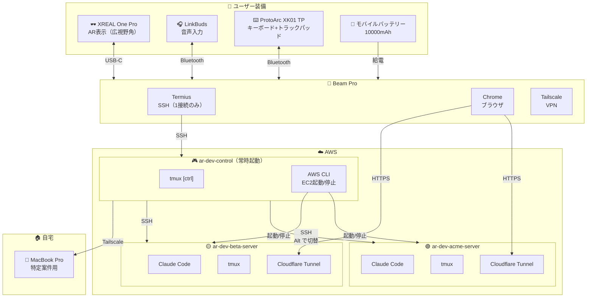

---

## 2. 利用シーン別構成

場所や状況に応じて、使用するデバイスと入力方法が異なります。

### 一覧

| シーン | AR表示 | 本体 | 入力 | 電源 | 想定時間 |
|--------|--------|------|------|------|----------|
| 🏠 自宅・外出先 | XREAL One Pro | Beam Pro | キーボード | 給電 | 長時間 |
| ☕ カフェ | XREAL One Pro | Beam Pro | キーボード | バッテリー | 2-3時間 |
| 🌳 公園・散歩 | XREAL One Pro | Beam Pro | 音声(LinkBuds) | バッテリー | 1時間 |
| 🚃 電車（座席時） | XREAL One Pro | Beam Pro | Gboard QWERTY | バッテリー | 30分 |

### 🏠 自宅・外出先（長時間作業）

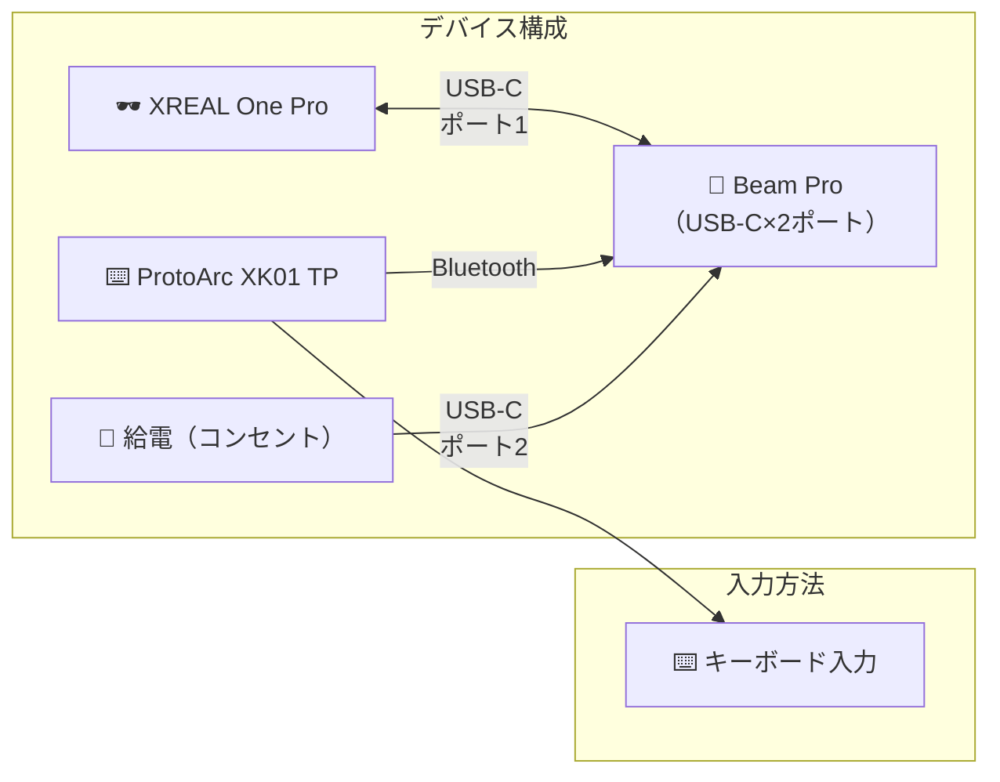

**特徴**
- Beam Proは2つのUSB-Cポートを搭載（グラス用 + 電源用）
- グラス接続と充電を同時に行えるため時間制限なし
- フルキーボード入力で本格的な開発
- トラックパッドでマウス操作も可能

> 💡 Beam ProはXREALグラスを接続しながら充電可能（パススルー充電アダプタ不要）

---

### ☕ カフェ（中時間作業）

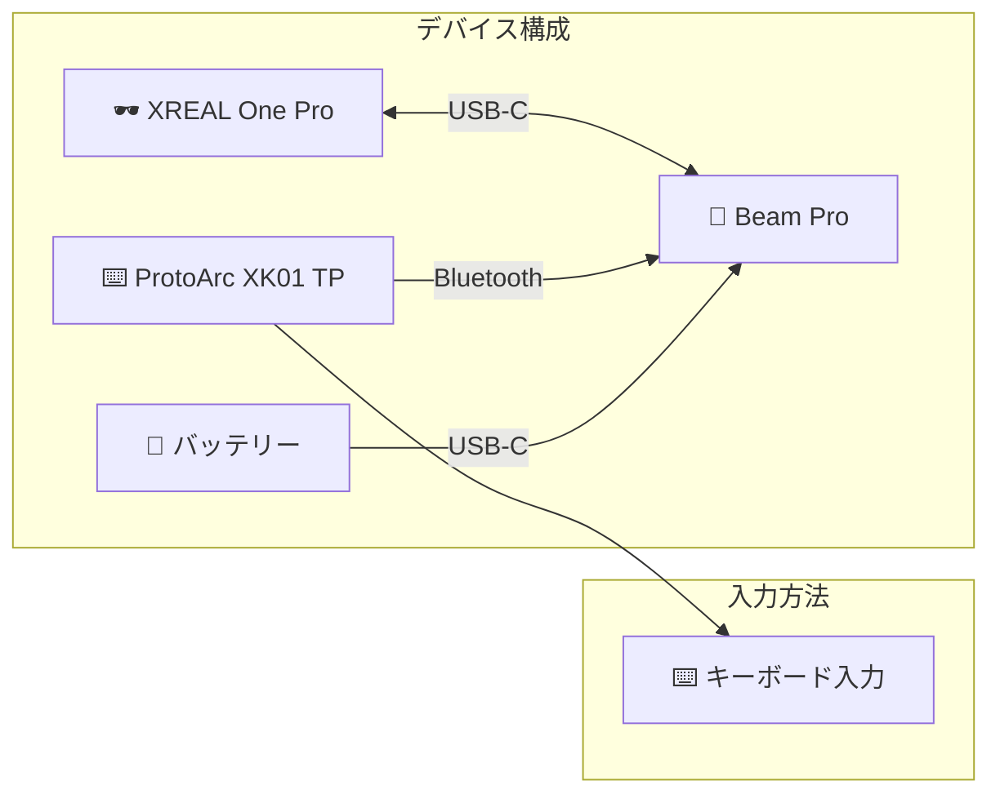

**特徴**
- バッテリー駆動（2-3時間目安）
- コンパクトな荷物で移動
- WiFi環境推奨

---

### 🌳 公園・散歩（ハンズフリー作業）

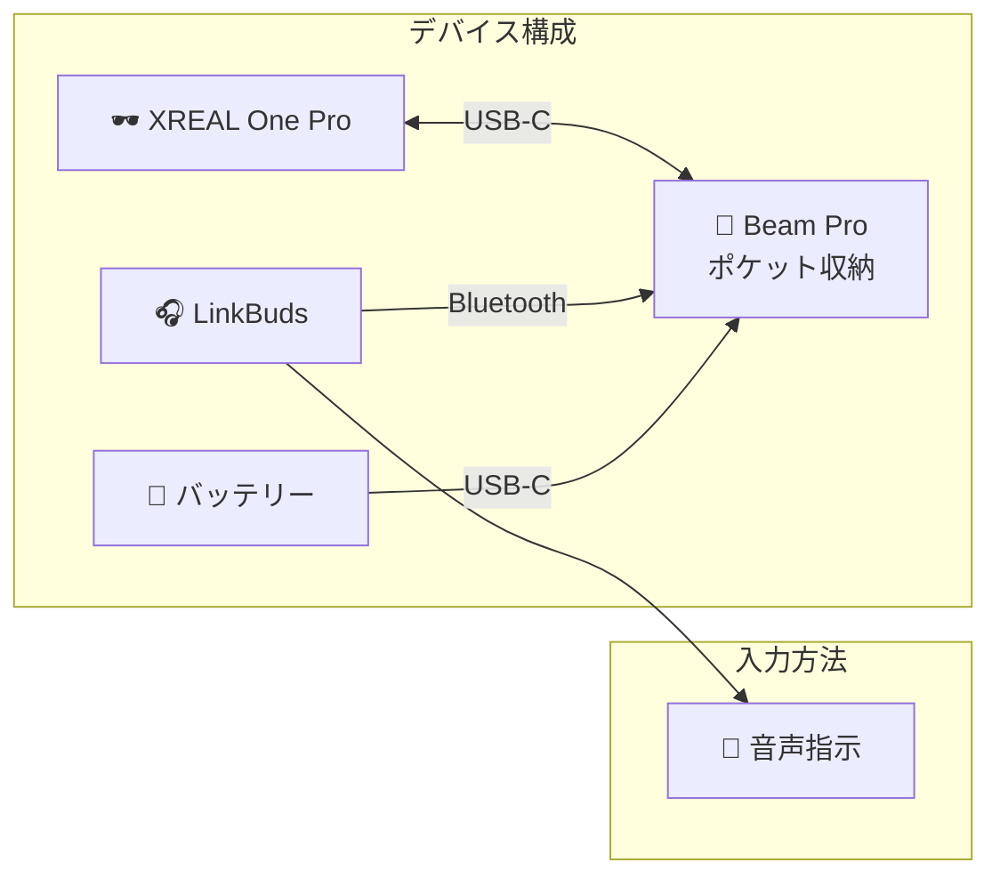

**特徴**
- 完全ハンズフリー
- Claude Codeへの音声指示でコード生成・レビュー
- 歩きながらアイデア整理・設計検討
- キーボード不要で荷物最小

**音声指示の例**
```
「この関数にエラーハンドリングを追加して」
「テストコードを書いて」
「このコードの問題点を教えて」
```

---

### 🚃 電車（座席確保時・短時間作業）

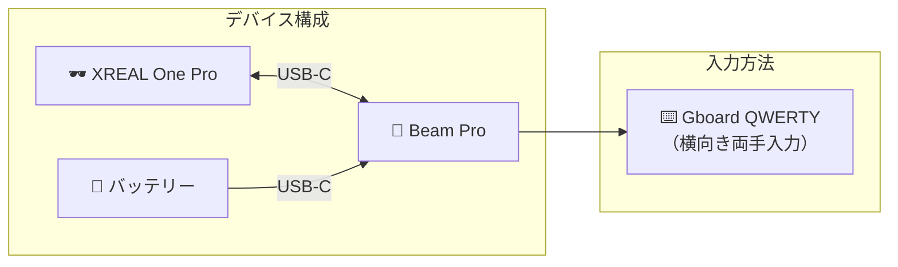

**特徴**
- 最小構成（ARグラス + Beam Pro + バッテリーのみ）
- 横向き + QWERTY配列で両手入力
- ARグラスの下からBeam Pro画面を見て入力
- キーボード不要で荷物削減

**向いている作業**
- Claude Codeへの短〜中程度の指示
- コードレビューの確認・コメント
- PRのマージ・作成
- Slackの確認・返信
- 軽微なコード修正

---

### シーン別比較

| シーン | 作業時間 | 作業内容 | 入力方法 | 通信 |
|--------|----------|----------|----------|------|
| 🏠 自宅・外出先 | ★★★ 長時間 | 本格開発 | 外付キーボード | WiFi/有線 |
| ☕ カフェ | ★★☆ 中時間 | 本格開発 | 外付キーボード | WiFi |
| 🌳 公園・散歩 | ★☆☆ 短時間 | 設計・レビュー | 音声 (LinkBuds) | テザリング |
| 🚃 電車（座席） | ★☆☆ 短時間 | 中程度の作業 | Gboard QWERTY | モバイル回線 |

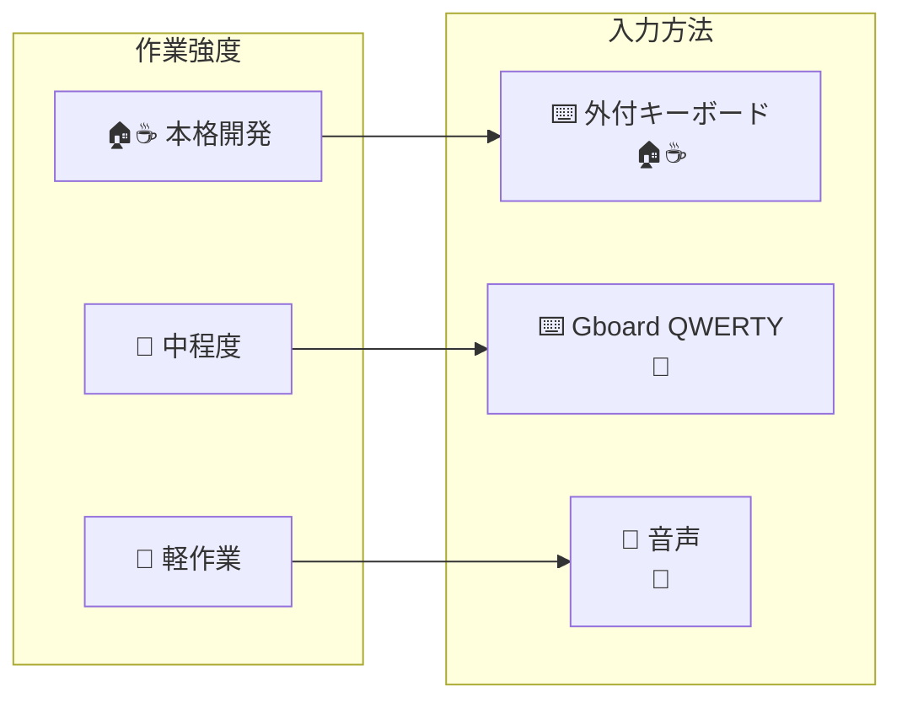

---

## 3. EC2内部構成

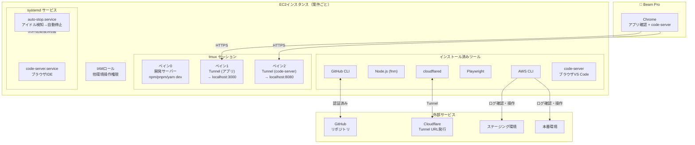

---

## 4. 作業分担

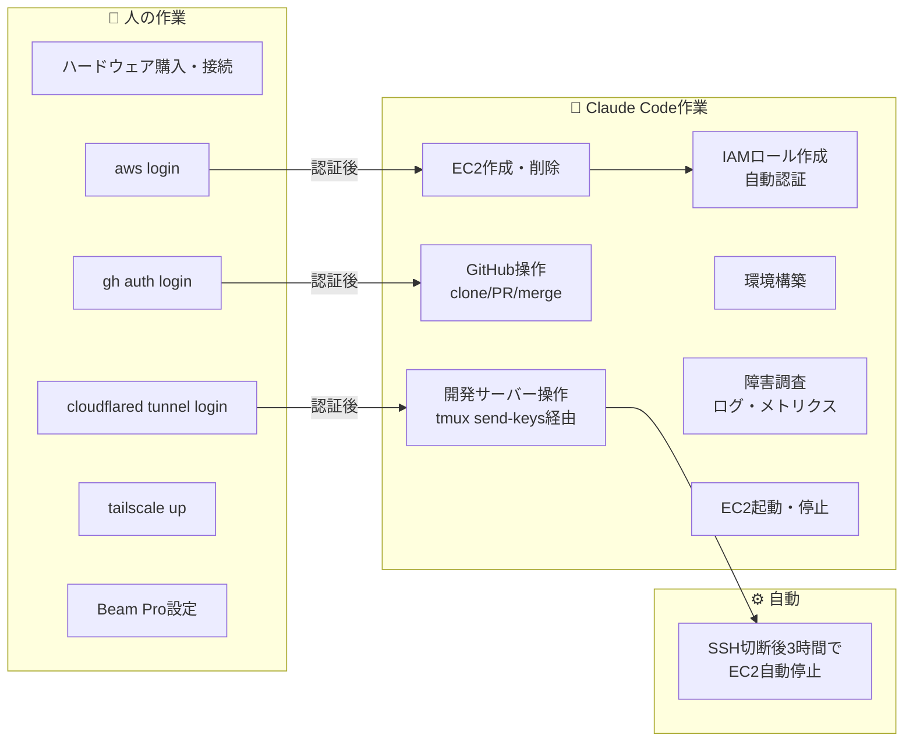

---

## 5. 案件ライフサイクル

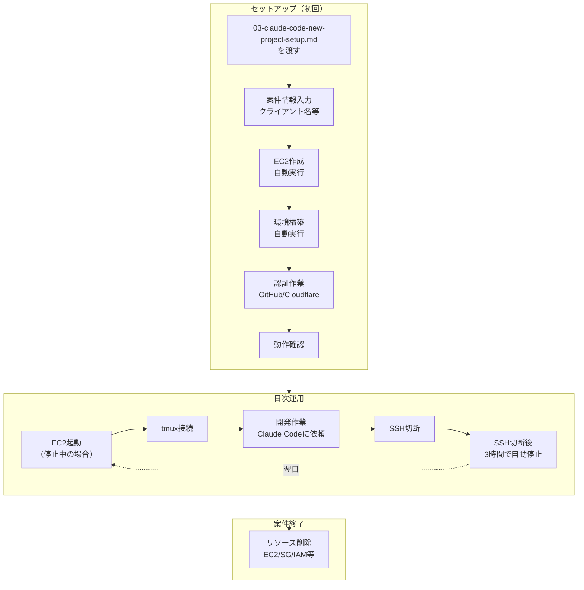

---

## 6. 自動停止判定ロジック

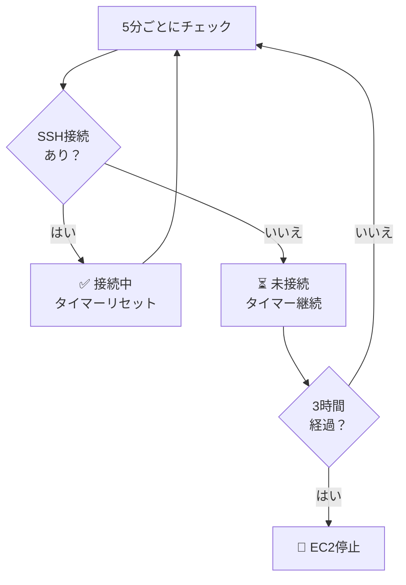

### ポイント

- **シンプルな判定**: SSH接続の有無のみ
- **3時間の猶予**: Claude Codeに依頼して離席しても安心
- **案件切り替え対応**: 複数案件を起動したまま作業可能

---

## 7. コスト構造

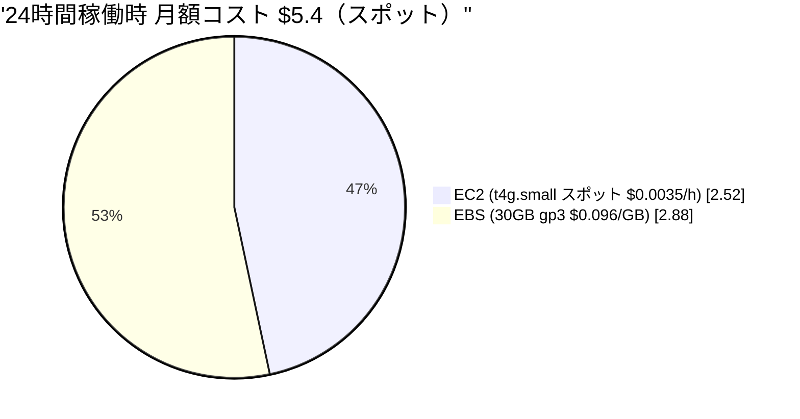

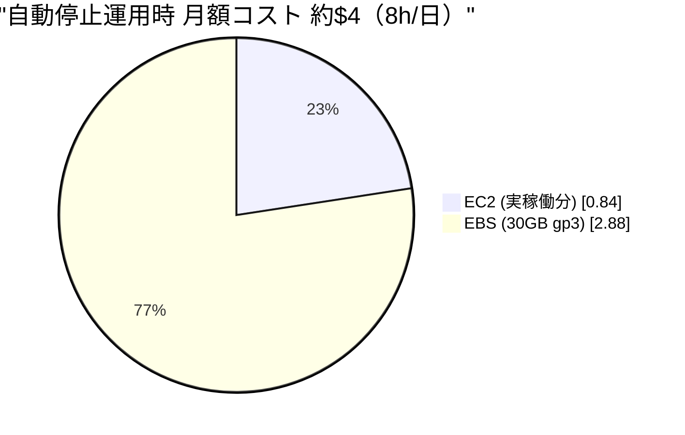

---

## 8. ファイル構成

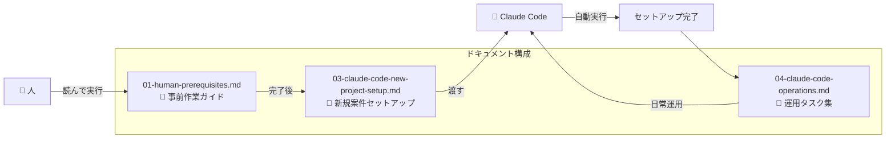

---

## 9. ネットワーク構成

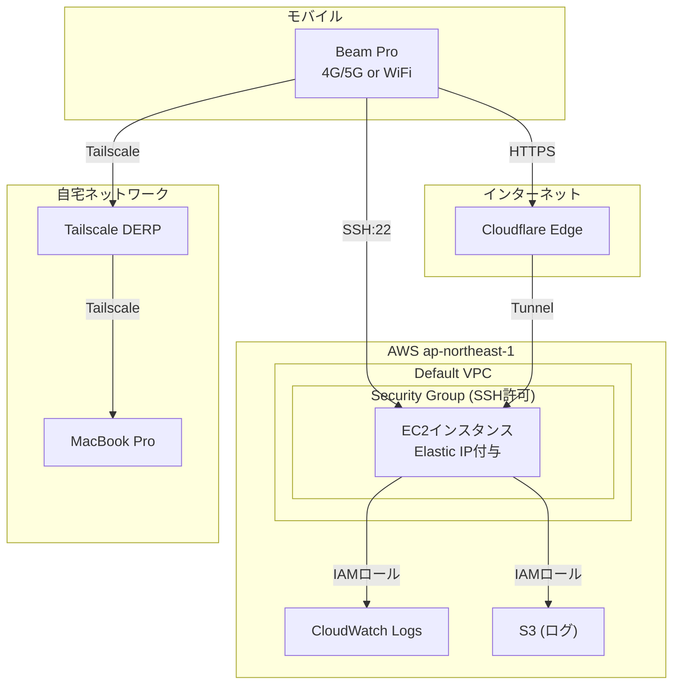

---

## 10. AWS権限構成（3段階）

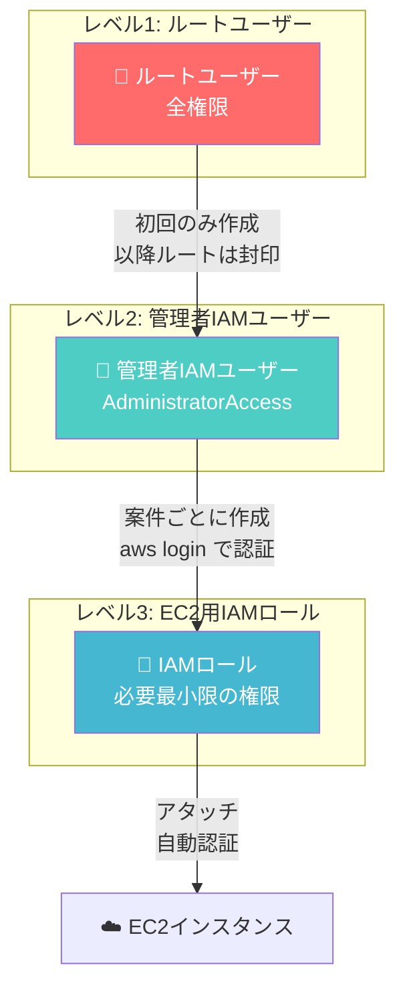

### 各レベルの役割

| レベル | ユーザー | 用途 | 認証 |
|--------|----------|------|------|
| 1 | ルートユーザー | 初期設定のみ | MFA必須、封印 |
| 2 | 管理者IAMユーザー | EC2作成、IAMロール作成 | `aws login` |
| 3 | EC2用IAMロール | EC2内からのAWS操作 | 自動（設定不要） |

---

## 11. コントロールEC2からの案件管理

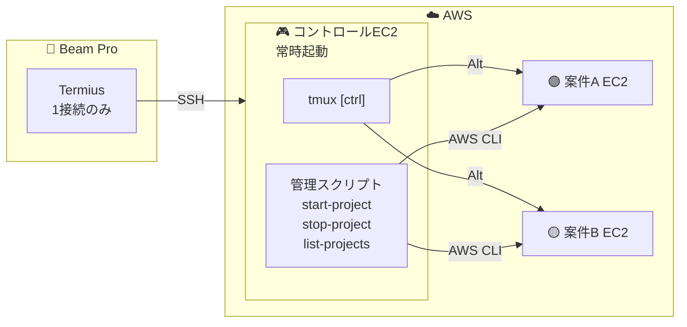

### 管理コマンド（コントロールEC2内）

```
list-projects     : 案件一覧
start-project XX  : 案件XX起動
stop-project XX   : 案件XX停止
start-all         : 全案件起動
stop-all          : 全案件停止
```

### tmux window切り替え

```
Alt + ]    → 次のwindow
Alt + [    → 前のwindow
```

### メリット

- キーボードだけで全操作完結
- Beam Pro に触る必要なし
- 複数案件の瞬時切り替え
3. 1-2分後に Termius で接続
